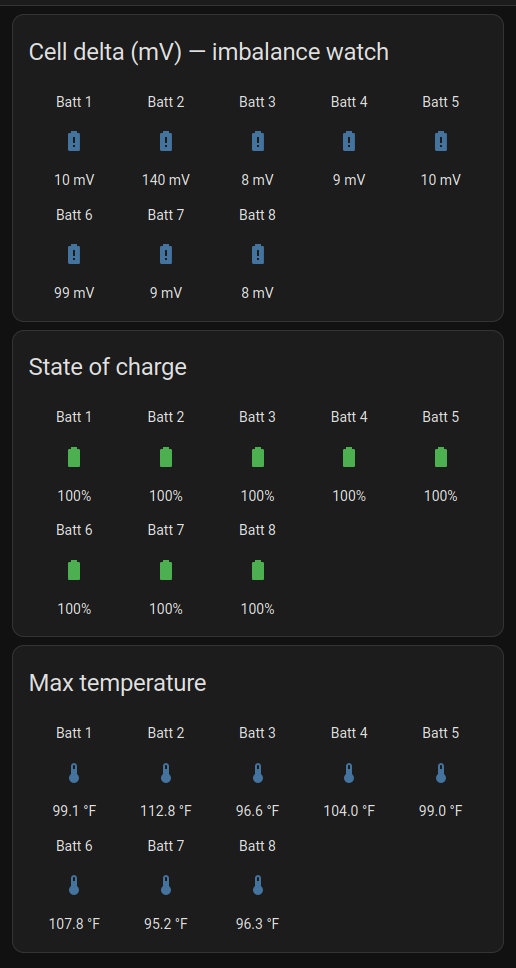
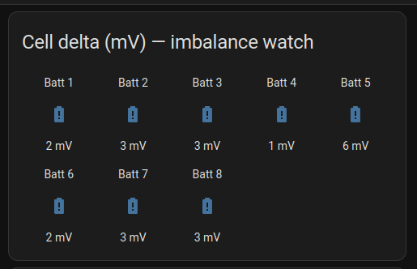
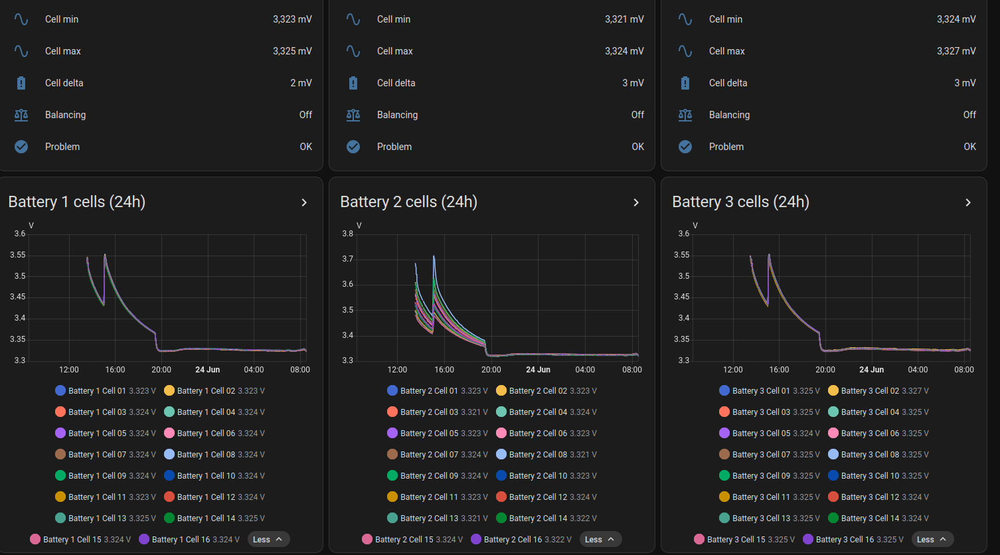
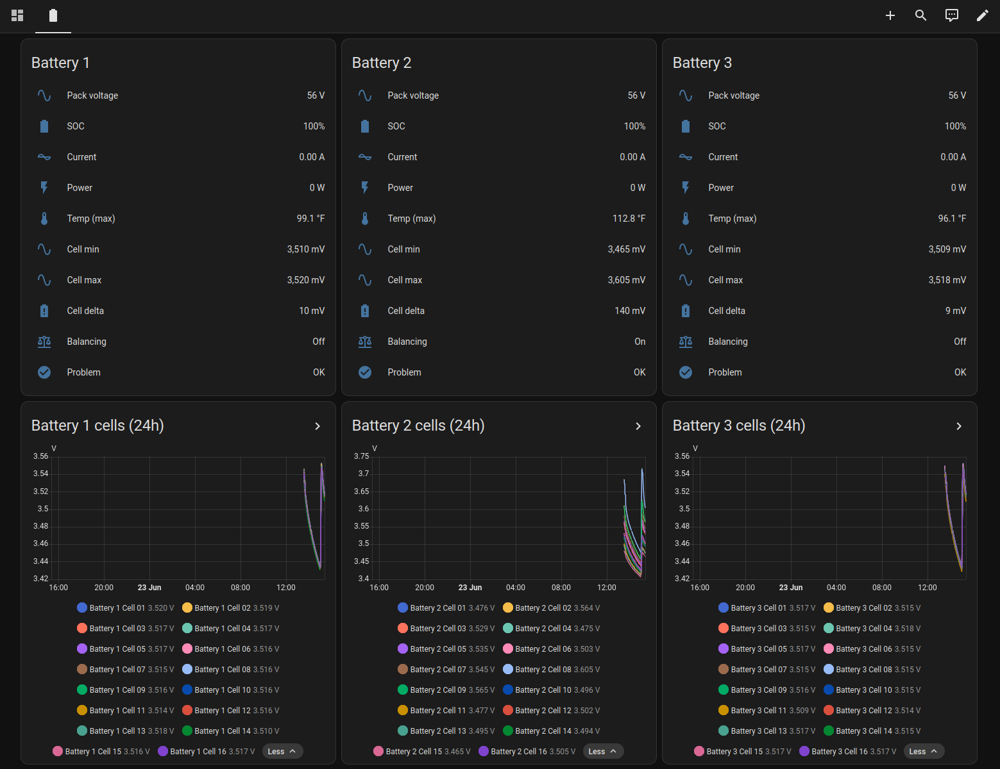

# BMS → MQTT → Home Assistant

Read every cell of multiple **JBD/Xiaoxiang-protocol BLE battery BMS** (e.g. Vatrer,
LiTime, Redodo, Overkill Solar, many 51.2 V LiFePO4 server-rack packs) over a
Raspberry Pi's Bluetooth, and publish pack + **per-cell** data to MQTT with **Home
Assistant auto-discovery**. Read-only — it never writes to the BMS.

Built and tested on a Raspberry Pi 4 monitoring **8× Vatrer 51.2 V 100 Ah** packs
(16 cells each) behind a Sungold SPH5048P inverter, running on the **Solar Assistant**
appliance image — but it works on a plain Raspberry Pi OS install too.

There's also an **optional closed-loop stage** (`pylon_emulator.py`): present all
your packs to a Sungold/SRNE-class inverter as one virtual **Pylontech** battery
over RS485, so it charges from real cell data instead of guessing SOC from
voltage. Monitoring works on its own; the closed loop is opt-in — see
**[docs/CLOSED-LOOP.md](docs/CLOSED-LOOP.md)**.



*The auto-generated "Batteries" dashboard — all 8 packs at a glance. Cell delta is the
imbalance number to watch (Battery 2 at 140 mV stands out here, **before** the closed
loop).*

**After the closed loop ran overnight**, the inverter throttling charge on the
weakest cell pulled the packs into line — Battery 2's imbalance fell from 140 mV to
just a few mV, and every pack is now in single digits:





*Same dashboard, the morning after. The per-cell graphs start spread apart and squeeze
together as the weak cells catch up, then track as one line. This is what closing the
loop buys you — see [docs/CLOSED-LOOP.md](docs/CLOSED-LOOP.md).*

---

## Table of contents
1. [What you get](#what-you-get)
2. [How it works](#how-it-works)
3. [Hardware](#hardware)
4. [Will my batteries work? (BMS compatibility)](#will-my-batteries-work-bms-compatibility)
5. [Prerequisites — Solar Assistant vs. plain Raspberry Pi OS](#prerequisites)
6. [Install the bridge](#install-the-bridge)
7. [Find your batteries (BLE scan)](#find-your-batteries-ble-scan)
8. [Run it](#run-it)
9. [Home Assistant integration](#home-assistant-integration)
   - [Option A — point HA at the Pi's broker](#option-a--point-ha-directly-at-the-pis-broker)
   - [Option B — bridge to HA's own broker](#option-b--bridge-to-has-own-broker-mosquitto-add-on)
   - [MQTT-in-HA tutorial](#mqtt-in-home-assistant--step-by-step)
   - [Dashboard & alerts](#dashboard--alerts)
10. [Configuration reference](#configuration-reference)
11. [Troubleshooting](#troubleshooting)
12. [Security notes](#security-notes)
13. [Files in this repo](#files-in-this-repo)
14. [Closing the loop to the inverter (optional)](#closing-the-loop-to-the-inverter-optional)
15. [Protocol reference & credits](#protocol-reference--credits)

---

## What you get
For each battery, published to MQTT and auto-created in Home Assistant as a device:
- **Pack:** voltage, current, power, SOC, remaining/nominal capacity, cycle count
- **Temps:** up to 3 sensors + max/min
- **Cells:** every cell voltage (`cell_01`…`cell_NN`), plus min / max / average / **delta**
  (the imbalance number you actually care about), and which cell is highest/lowest
- **Status:** protection text, a "Problem" binary, charge/discharge FET state, balancing

Roughly **39 Home Assistant entities per battery** (for a 16-cell pack).

---

## How it works
```
 8× BMS  ──Bluetooth LE──▶  Raspberry Pi                       ┌─ Home Assistant ─┐
                            ┌───────────────────────────┐      │                  │
                            │ bms_mqtt.py (systemd svc)  │      │  MQTT            │
                            │  • polls each pack in turn │      │  integration     │
                            │  • parses JBD frames       │      │   → 8 devices,   │
                            │  • publishes HA discovery  │      │     all cells    │
                            └─────────────┬─────────────┘      │                  │
                                          ▼                     └────────▲─────────┘
                                  Mosquitto broker  ──(optional bridge)──┘
                                  (on the Pi, :1883)
```
The service connects to one battery at a time over BLE, sends the JBD "basic info"
(`0x03`) and "cell voltages" (`0x04`) commands, decodes the replies, and publishes a
retained JSON state per battery plus Home Assistant MQTT-discovery config. A full
round of 8 packs takes ~90–150 s; cell balance changes slowly, so that's plenty.

**Why one-at-a-time + retries:** a single Bluetooth adapter talking to many packs is
the real-world constraint. The code learned three lessons the hard way:
- the BMS needs a **~2 s settle** after connecting before notifications flow;
- connections intermittently time out → **3 retries** per pack with a gap;
- a pack stops advertising while something is connected to it, so a crashed run can
  leave it "stuck" → each read **re-discovers the device** and falls back to
  connect-by-address.

---

## Hardware
- **Raspberry Pi 3/4/5** (or any Linux box with Bluetooth LE). Tested on Pi 4.
  - Built-in BLE is fine for packs within a few meters. For 8 packs in a rack it
    works but expect the occasional retry (handled automatically). A USB BLE dongle
    on an extension can improve range if packs are far/shielded.
- **Batteries** with a JBD/Xiaoxiang BLE BMS (see compatibility below).
- That's it — monitoring is **read-only over Bluetooth**, no wiring to the batteries.

---

## Will my batteries work? (BMS compatibility)
This targets the **JBD / Xiaoxiang** BLE protocol (also sold as Overkill Solar, and
OEM'd inside many LiFePO4 brands incl. Vatrer). Identify yours:

1. Scan for the BMS (see [Find your batteries](#find-your-batteries-ble-scan)).
2. Connect and list GATT services. It's JBD if you see **service `0xFF00`** with
   characteristics **`0xFF01`** (notify) and **`0xFF02`** (write):
   ```bash
   gatttool -b AA:BB:CC:DD:EE:FF --primary
   gatttool -b AA:BB:CC:DD:EE:FF --characteristics
   ```
3. Sanity-check a live read without any code (no install needed):
   ```bash
   DEV=AA:BB:CC:DD:EE:FF
   { echo "connect"; sleep 3; echo "char-write-req 0x0012 0100"; sleep 1; \
     echo "char-write-cmd 0x0015 dda50400fffc77"; sleep 3; echo "disconnect"; echo "exit"; } \
     | gatttool -b $DEV -I | grep Notification
   ```
   A reply starting `dd 04 00 ...` is the cell-voltage frame → you're compatible.
   (`0x0012` is the notify CCCD and `0x0015` is the `0xFF02` write handle on the
   tested packs; if your handles differ, use the ones from step 2.)

Other BMS families (JK/JIKONG `ffe0`, Daly, Seplos, Pylontech…) use different
protocols and are **not** decoded here — see "BMS_BLE-HA" or "batmon-ha" for those.

> Brand label: the HA device shows a **manufacturer / model** that defaults to
> "Vatrer / 51.2 V 100 Ah (JBD BMS)". Set your own with `device_defaults` (applies to
> every pack) and/or a per-battery `manufacturer`/`model` in `config.json` — see
> [Configuration reference](#configuration-reference). The pack `serial` is appended to
> the model automatically.

### 24 V / 36 V (and other cell counts) — no code changes
The cell count is read **live from each BMS**, not assumed, so **8S (24 V), 12S (36 V),
16S (48 V)** and anything else "just work" for monitoring. Each pack reports its own cell
count and HA creates exactly that many cell sensors automatically — an 8S pack gets 8, a
12S gets 12. You can even mix different-voltage packs on the **same dashboard** at the
same time; just add each one to the `batteries` list. Nothing to edit, no per-cell config.

> Only the optional **closed-loop** stage cares about pack voltage (it sends a pack-level
> charge/discharge limit to the inverter). Two numbers change there — see
> [Closing the loop → different pack voltages](#closing-the-loop-to-the-inverter-optional).

---

## Prerequisites
You need: a Linux Pi, the Bluetooth stack (BlueZ), an MQTT broker (Mosquitto), and
two Python libraries (`bleak`, `paho-mqtt`).

### If you run Solar Assistant
Solar Assistant already gives you a Debian 12 base **and a running Mosquitto broker
on `:1883`** (anonymous on the LAN), which this project reuses. You still install the
two Python libs + the MQTT CLI tools. SSH in (`ssh solar-assistant@<pi-ip>`), then:
```bash
sudo apt-get update
sudo apt-get install -y --no-install-recommends \
    python3-bleak python3-paho-mqtt mosquitto-clients
```
> Heads-up: a Solar Assistant **OS update may remove** apt-installed packages and your
> custom service/bridge files. Keep this repo so you can re-run the install.

### If you DON'T run Solar Assistant (plain Raspberry Pi OS / Debian)
Install everything, including the broker:
```bash
sudo apt-get update
sudo apt-get install -y --no-install-recommends \
    bluez mosquitto mosquitto-clients python3-bleak python3-paho-mqtt
sudo systemctl enable --now bluetooth mosquitto
```
Allow local MQTT clients (Mosquitto 2.x denies by default). Create
`/etc/mosquitto/conf.d/local.conf`:
```
listener 1883 0.0.0.0
allow_anonymous true
```
…then `sudo systemctl restart mosquitto`. (For a non-trusted network, set up a
password instead — see [Security](#security-notes).)

To build the HA **dashboard** with the included script you also need:
```bash
sudo apt-get install -y --no-install-recommends python3-websockets
```

---

## Install the bridge
```bash
sudo mkdir -p /opt/bms-mqtt
sudo chown "$USER" /opt/bms-mqtt
# copy the repo files into /opt/bms-mqtt (git clone, scp, etc.)
cp config.example.json config.json      # then edit config.json (next section)
```
Install the service (runs as user `solar-assistant`; change `User=`/`Group=` in the
unit if your login differs, and make sure that user can use BlueZ:
`sudo usermod -aG bluetooth <user>`):
```bash
sudo cp systemd/bms-mqtt.service /etc/systemd/system/
sudo systemctl daemon-reload
sudo systemctl enable --now bms-mqtt
```

---

## Find your batteries (BLE scan)
```bash
# ~20 s scan; note the MAC + advertised name (often the battery serial) of each pack
timeout 25 bluetoothctl --timeout 20 scan on
bluetoothctl devices
```
Put each MAC into `config.json`, give it a friendly `name`, and record the `serial`
so you can match a MAC to a physical pack (the serial usually matches the label /
the vendor app). Example:
```json
"batteries": [
  { "mac": "A4:C1:37:11:22:33", "name": "Battery 1", "serial": "REPLACE-ME-001" }
]
```

---

## Run it
```bash
sudo systemctl restart bms-mqtt
journalctl -u bms-mqtt -f            # watch it poll: "[Battery 1] 56.5V ... d=12mV"
```
Confirm data on the broker (from the Pi or any LAN machine with mosquitto-clients):
```bash
mosquitto_sub -h <pi-ip> -t 'bms/#' -v          # live state + availability
mosquitto_sub -h <pi-ip> -t 'homeassistant/#' -v  # the discovery configs
```
Topics:
| Topic | Meaning |
|---|---|
| `bms/<id>/state` | retained JSON: all pack + cell values |
| `bms/<id>/availability` | `online`/`offline` per pack |
| `bms/bridge/status` | bridge service up/down (MQTT last-will) |
| `homeassistant/.../config` | HA discovery (retained) |

`<id>` is the last 3 bytes of the MAC (e.g. `112233`).

---

## Home Assistant integration
You need HA talking to an MQTT broker that has these topics. Two ways:

### Option A — point HA directly at the Pi's broker
Simplest if you don't already run an MQTT broker in HA. HA's MQTT integration
connects straight to the Pi (`<pi-ip>:1883`). Skip the bridge file entirely.

### Option B — bridge to HA's own broker (Mosquitto add-on)
If you already run the **Mosquitto broker add-on** in HA (so other devices use it),
forward the battery topics from the Pi into HA's broker with a Mosquitto bridge:
```bash
cp mosquitto/ha-bridge.conf.example /tmp/ha-bridge.conf
# edit /tmp/ha-bridge.conf: set REMOTE_HA_IP and the MQTT user/pass
#   (any HA login works as MQTT creds on the add-on; or comment them out if the
#    HA broker allows anonymous)
sudo cp /tmp/ha-bridge.conf /etc/mosquitto/conf.d/ha-bridge.conf
sudo chown root:root /etc/mosquitto/conf.d/ha-bridge.conf
sudo chmod 640 /etc/mosquitto/conf.d/ha-bridge.conf
sudo systemctl restart mosquitto
```
Verify the topics arrived on the HA broker:
```bash
mosquitto_sub -h <ha-ip> -u <mqtt-user> -P <mqtt-pass> -t 'bms/#' -v
```

### MQTT in Home Assistant — step by step
*(Do this once. If you use the Mosquitto add-on, install it first: **Settings →
Add-ons → Add-on Store → Mosquitto broker → Install → Start**.)*

1. **Settings → Devices & Services → Add Integration** (bottom-right).
2. Search **MQTT** and select it.
3. **Broker**:
   - Option A: the **Pi's IP** (`<pi-ip>`), **Port** `1883`.
   - Option B: your HA broker — usually `core-mosquitto`, **Port** `1883`.
4. **Username/Password**: enter your MQTT user, or leave blank if the broker allows
   anonymous. Submit.
5. HA discovers the batteries automatically (discovery messages are retained, so they
   appear immediately). Find them under **Settings → Devices & Services → MQTT →
   *N* devices**, named "Battery 1"…"Battery N".
6. (Optional) Rename a device or its entities from that screen.

> Discovery prefix must match on both ends. Default is `homeassistant` here and in HA;
> if you changed HA's MQTT discovery prefix, set `discovery_prefix` in `config.json` to
> match.

### Dashboard & alerts
Two helper scripts build a ready-made dashboard and alert automations via the HA API.

1. Create a **long-lived access token**: HA → your **profile → Security → Create
   Token**. Save it (e.g. `echo -n '<token>' > /opt/bms-mqtt/.ha_token && chmod 600
   /opt/bms-mqtt/.ha_token`). Use an **admin** account's token for the automations.
2. Run them (point at your HA + token; set `NUM_BATTERIES` if not 8):
   ```bash
   export HA_URL=http://<ha-ip>:8123
   export HA_TOKEN_FILE=/opt/bms-mqtt/.ha_token
   export NUM_BATTERIES=8
   python3 homeassistant/ha_dashboard.py     # creates the "Batteries" dashboard (sidebar)
   python3 homeassistant/ha_automations.py   # creates 3 alert automations
   ```
**Dashboard** "Batteries": an *Overview* view (cell-delta / SOC / temp glance for all
packs — shown at the [top of this README](#bms--mqtt--home-assistant)) and a *Per
battery* view (stats + a 24 h history graph of every cell):



**Automations** (persistent notifications by default — change the action to
`notify.mobile_app_<device>` for phone alerts):
- `bms_cell_imbalance` — any pack's cell delta > 120 mV
- `bms_cell_out_of_range` — any cell < 3.00 V or > 3.65 V
- `bms_battery_offline` — a pack stops reporting for 5 min

Thresholds are env-overridable: `DELTA_MV`, `CELL_MIN_MV`, `CELL_MAX_MV`, `OFFLINE_MIN`.

---

## Configuration reference
`config.json`:
| Key | Meaning |
|---|---|
| `mqtt.host` / `port` | broker to publish to (usually `127.0.0.1:1883` on the Pi) |
| `mqtt.username` / `password` | set if your broker requires auth (else `null`) |
| `mqtt.base_topic` | topic root (default `bms`) |
| `mqtt.discovery_prefix` | HA discovery prefix (default `homeassistant`) |
| `poll.cycle_seconds` | min seconds between the *start* of each full round |
| `poll.connect_timeout` | per-connection BLE timeout |
| `poll.settle_seconds` | wait after connect before talking (≈2 s; don't lower much) |
| `poll.notify_timeout` | wait for a command's reply |
| `poll.find_timeout` | per-pack BLE discovery timeout before connecting |
| `poll.attempts` / `retry_seconds` | retries per pack and the gap between them |
| `poll.gap_seconds` | pause between packs (helps the single radio settle) |
| `device_defaults.manufacturer` / `model` | *(optional)* HA device brand/model for all packs; defaults to `Vatrer` / `51.2V 100Ah (JBD BMS)` |
| `batteries[]` | per pack: `mac`, `name`, `serial`, and optional `manufacturer` / `model` to override `device_defaults` for that pack |
| `emulator` | *(optional)* closed-loop settings used only by `pylon_emulator.py` — every key is documented in **[docs/CLOSED-LOOP.md](docs/CLOSED-LOOP.md)**. Leave it out for monitoring-only. |

---

## Troubleshooting
- **A pack often times out / "not advertising":** normal occasionally on one shared
  radio — retries handle it. If one pack *always* fails: it may be out of range, or
  stuck "connected" from a crashed run. Clear it:
  ```bash
  bluetoothctl devices Connected
  bluetoothctl disconnect AA:BB:CC:DD:EE:FF
  ```
- **Nothing in HA:** confirm topics exist on the broker HA actually uses
  (`mosquitto_sub -h <broker> -t 'homeassistant/#' -v`). With the add-on you usually
  need Option B (bridge). Check the MQTT integration is connected (Settings → Devices
  & Services → MQTT).
- **`bleak` import or D-Bus errors under systemd:** ensure the service `User=` is in
  the `bluetooth` group (`sudo usermod -aG bluetooth <user>`) and `bluetooth.service`
  is running.
- **Wrong values / `0x80` status:** a non-JBD BMS, or a clone with a slightly
  different frame. Capture a raw frame (the gatttool snippet above) and compare to the
  parser in `bms_mqtt.py`.
- **Service won't start after editing the bridge config:** a bad
  `/etc/mosquitto/conf.d/*.conf` stops Mosquitto (which Solar Assistant needs). Remove
  the file and `sudo systemctl restart mosquitto` to recover.

---

## Security notes
- The tested setup uses an **anonymous MQTT broker on the LAN** — fine for a trusted
  home network, not for an exposed one. To require auth: `mosquitto_passwd -c
  /etc/mosquitto/passwd <user>`, set `allow_anonymous false`, and put the credentials
  in `config.json` (and the bridge file / HA integration).
- The HA **long-lived token** and any MQTT password are **secrets**. They live only in
  `.ha_token` (chmod 600) and the root-only bridge file, and are **excluded from this
  repo** via `.gitignore`. Revoke a token anytime from HA → profile → Security.

---

## Files in this repo
| File | Purpose |
|---|---|
| `bms_mqtt.py` | the bridge service (BLE → MQTT, HA discovery) |
| `config.example.json` | copy to `config.json` and fill in your packs (and, optionally, the `emulator` block) |
| `systemd/bms-mqtt.service` | systemd unit for the bridge |
| `mosquitto/ha-bridge.conf.example` | optional Pi→HA broker bridge (Option B) |
| `homeassistant/ha_dashboard.py` | build the "Batteries" dashboard via HA WS API |
| `homeassistant/ha_automations.py` | create the alert automations via HA REST API |
| `images/` | dashboard screenshots used in this README |
| `.gitignore` | keeps secrets / machine-specific files out of git |
| **Closed loop (optional):** | |
| `pylon_emulator.py` | presents all packs as one virtual Pylontech battery to the inverter over RS485 (`--selftest` to validate the codec) |
| `systemd/bms-emulator.service` | systemd unit for the emulator |
| `udev/99-rs485-adapters.rules.example` | stable `/dev/rs485-*` names for the two USB-RS485 adapters |
| `docs/CLOSED-LOOP.md` | full from-scratch closed-loop guide (wiring, dry-run, cutover, revert, safety) |
| `docs/closed-loop-explained.txt` | plain-English, non-technical explainer |

Not included (secrets / machine-specific): `config.json`, `ha-bridge.conf`,
`.ha_token`.

---

## Closing the loop to the inverter (optional)
The monitoring above is read-only. The optional second stage feeds aggregated pack
data back to the inverter so it charges from the **weakest cell** instead of guessing
SOC from voltage. It's implemented and running on the tested rig — `pylon_emulator.py`
presents all 8 packs to the Sungold SPH5048P as one virtual **Pylontech (PYL)** battery
over a second USB-RS485 adapter.

How it fits together:
```
  bms_mqtt.py ──MQTT──▶ pylon_emulator.py ──RS485 (PYL)──▶ inverter
   (reads BLE)            • avg V, sum A, worst cell/temp     (charges on
                          • derives CVL/CCL/DVL/DCL limits     real cell data)
```
- Many all-in-one inverters (Sungold, Growatt, SRNE, etc.) accept a closed-loop BMS
  over **RS485 or CAN**. The tested Sungold SPH5048P is **RS485-only**.
- The emulator throttles charge/discharge on the worst cell and temperature, **stops
  answering** if pack data goes stale (inverter falls back to its own settings), and
  is **read-only toward the batteries**. One-line revert: set the inverter's RS485 port
  back to plain `485`.
- ⚠️ This stage changes how an expensive bank is charged. Set every limit from **your**
  battery's datasheet, use the built-in `listen_only` dry-run, and go live when a brief
  power blip is acceptable.

👉 **Full from-scratch guide: [docs/CLOSED-LOOP.md](docs/CLOSED-LOOP.md)**
(hardware, udev, dry-run, cutover, revert, safety, tuning). Plain-English version:
[docs/closed-loop-explained.txt](docs/closed-loop-explained.txt).

### Different pack voltages (24 V / 36 V / other cell counts)
The emulator's charge/discharge brain runs off **per-cell millivolts** and SOC, which are
identical for any LiFePO4 series count — so all the `cell_*_mv` thresholds stay the same.
Only the **two pack-level voltage limits** scale with the number of cells in series (N):

| Key | 16S (48 V) | 12S (36 V) | 8S (24 V) | Rule |
|---|---|---|---|---|
| `cvl_volts` (charge ceiling) | 55.2 | 41.4 | 27.6 | ≈ 3.45 V × N |
| `dvl_volts` (discharge floor) | 48.0 | 36.0 | 24.0 | ≈ 3.00 V × N |

Set them from **your** battery's datasheet. Current limits (`ccl_max_amps` /
`dcl_max_amps`) are in amps and don't change with voltage.

> ⚠️ One emulator instance feeds **one voltage class**: it averages pack voltage and sums
> current, which is only valid for packs of the **same** cell count wired in parallel
> (you can't parallel a 24 V and a 48 V battery). Mixed-voltage banks go to separate
> inverters — run one emulator instance per bank, each on its own RS485 port and config.

---

## Protocol reference & credits
- JBD / Xiaoxiang BLE protocol: service `0xFF00`, notify `0xFF01`, write `0xFF02`.
  Requests `DD A5 <reg> 00 <chkH> <chkL> 77` (`reg` `0x03` = basic info, `0x04` =
  cell voltages). Replies `DD <reg> <status> <len> <data…> <chkH> <chkL> 77`;
  checksum = `0x10000 − sum(status..data)`. Voltages ÷100 → V, current is signed
  ÷100 → A, temps `(raw − 2731)/10` → °C, cells are big-endian mV.
- Built with [bleak](https://github.com/hbldh/bleak) and
  [paho-mqtt](https://www.eclipse.org/paho/). Inspired by the many community JBD/Overkill
  Solar BMS tools. Released into the **public domain** (The Unlicense) — use it
  however you like, no restrictions (see `LICENSE`).
